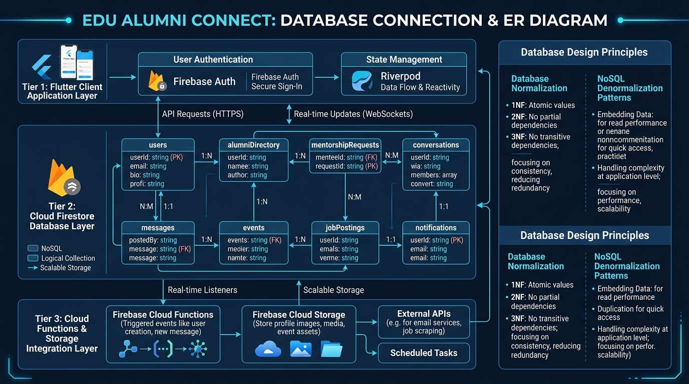
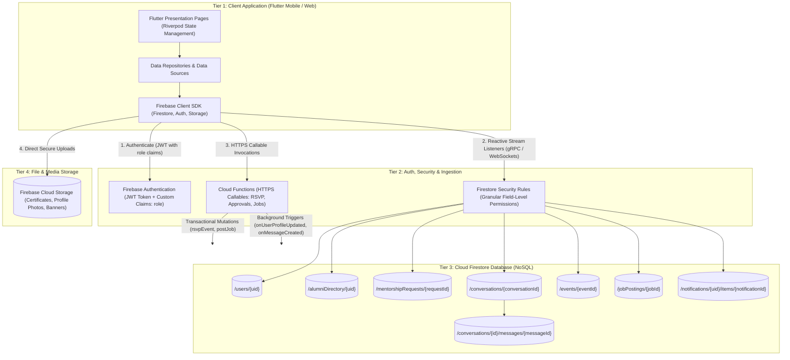
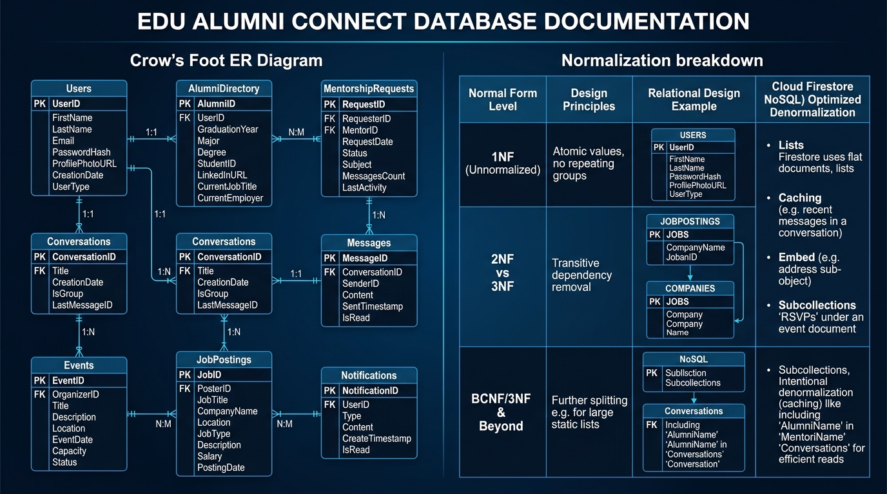

# EDU Alumni Connect — Database Architecture, ER Diagram & Normalization Guide

This document provides a comprehensive technical overview of the database architecture, connection flow, Entity-Relationship (ER) model, Normalization proofs (1NF to 3NF/BCNF), and intentional NoSQL denormalization patterns used in **EDU Alumni Connect**.

---

## 1. Database Connection & System Architecture

The application implements a modern **4-Tier Reactive Cloud Architecture** using **Flutter** on the client, **Firebase Auth & Cloud Functions** on the compute/security tier, and **Cloud Firestore & Firebase Storage** on the data persistence tier.



### Connection Lifecycle & Data Flow



### Connection Protocols & Security Mechanism
1. **gRPC / WebSocket Streaming**: The client maintains persistent bidirectional channels with Cloud Firestore for real-time document listeners (`snapshots()`), enabling live chat and instant notification delivery with offline caching.
2. **Role-Based Token Claims**: Firebase Authentication issues JWT tokens containing custom claims (`request.auth.token.role == 'admin' | 'alumni' | 'student'`).
3. **Firestore Security Rules Engine**: Every direct client read/write is evaluated against `firestore.rules`.
4. **Cloud Functions Boundary**: Sensitive business operations (verification approvals, mentorship request transactions, RSVP seat reservations) bypass client writes and execute via authenticated HTTPS Callables with Admin SDK privileges.

---

## 2. Entity-Relationship (ER) Diagram



### Crow's Foot Entity-Relationship Model (Mermaid ER)

```mermaid
erDiagram
    USERS ||--o| ALUMNI_DIRECTORY : "mirrors (1:1)"
    USERS ||--o{ MENTORSHIP_REQUESTS : "initiates as student (1:N)"
    USERS ||--o{ MENTORSHIP_REQUESTS : "receives as alumni (1:N)"
    USERS ||--o{ JOB_POSTINGS : "posts (1:N)"
    USERS ||--o{ EVENTS : "creates as admin (1:N)"
    USERS ||--o{ NOTIFICATIONS : "owns subcollection (1:N)"
    USERS }o--o{ CONVERSATIONS : "participates in (N:M)"
    CONVERSATIONS ||--|{ MESSAGES : "contains subcollection (1:N)"
    USERS ||--o{ MESSAGES : "sends (1:N)"
    USERS }o--o{ EVENTS : "rsvps to (N:M)"

    USERS {
        string uid PK "Firebase Auth UID"
        string email UK "University email"
        string fullName "User full name"
        string role "student | alumni | admin"
        string verificationStatus "pending | verified | rejected"
        string photoUrl "Profile image URL"
        string coverPhotoUrl "Cover image URL"
        string department "Academic department"
        int batchYear "Graduation/Enrollment year"
        string currentCompany "Nullable employer name"
        string jobTitle "Nullable current designation"
        string certificateUrl "Alumni verification proof"
        timestamp createdAt "Registration timestamp"
        timestamp updatedAt "Last update timestamp"
    }

    ALUMNI_DIRECTORY {
        string uid PK "Matches users.uid"
        string fullName "Denormalized name"
        string department "Department index"
        int batchYear "Batch year index"
        string currentCompany "Company name"
        string jobTitle "Professional title"
        array skills "List of skill tags [String]"
        string location "Geographic location"
        string photoUrl "Cached profile avatar"
        string bio "Alumni personal biography"
        boolean openToMentorship "Mentorship availability"
    }

    MENTORSHIP_REQUESTS {
        string requestId PK "Unique Request ID"
        string studentId FK "users.uid (Student)"
        string alumniId FK "users.uid (Alumni)"
        string studentName "Cached student name"
        string studentPhotoUrl "Cached student photo"
        string alumniName "Cached alumni name"
        string alumniPhotoUrl "Cached alumni photo"
        string status "pending | accepted | declined | completed"
        string message "Introduction message"
        string declineReason "Optional reason if rejected"
        timestamp createdAt "Request timestamp"
        timestamp updatedAt "Status change timestamp"
    }

    CONVERSATIONS {
        string conversationId PK "Unique ID or deterministic hash"
        array participantIds "List of user UIDs [String]"
        map participantDetails "Map of UID -> {fullName, photoUrl}"
        string lastMessage "Last message snippet"
        timestamp lastMessageAt "Last activity timestamp"
        string lastMessageSenderId "UID of last sender"
        map unreadCount "Map of UID -> int"
        boolean isGroup "1:1 vs Group chat flag"
        string groupName "Nullable group subject"
        timestamp createdAt "Creation timestamp"
    }

    MESSAGES {
        string messageId PK "Subcollection item ID"
        string senderId FK "users.uid of sender"
        string text "Message body text"
        string type "text | image | document | voice"
        string mediaUrl "Storage URL for attachments"
        string fileName "Original file name"
        string fileSize "Formatted size string"
        string duration "Audio length string"
        timestamp sentAt "Sent timestamp"
        array readBy "List of user UIDs who read message"
    }

    EVENTS {
        string eventId PK "Unique Event ID"
        string title "Event title"
        string description "Detailed description"
        string tag "Category tag (Workshop, Reunion, etc.)"
        timestamp dateTime "Scheduled event timestamp"
        string date "Formatted date string"
        string time "Formatted time string"
        string location "Physical venue or meeting URL"
        string bannerUrl "Event cover banner"
        boolean isOnline "Virtual event flag"
        int maxAttendees "Capacity limit"
        int rsvpCount "Denormalized attendee counter"
        array rsvpUserIds "List of attendee UIDs"
        string postedByAdminId FK "users.uid (Admin)"
        boolean reminderSent "Cron reminder flag"
        timestamp createdAt "Creation timestamp"
    }

    JOB_POSTINGS {
        string jobId PK "Unique Job ID"
        string postedByAlumniId FK "users.uid (Poster)"
        string posterName "Cached alumni poster name"
        string posterPhotoUrl "Cached poster photo"
        string title "Job title / position"
        string company "Hiring organization"
        string location "Job location / Remote"
        string jobType "Full-time | Part-time | Internship"
        string description "Job details & requirements"
        string applyLink "Application URL or mailto link"
        string status "active | closed"
        timestamp postedAt "Publication timestamp"
    }

    NOTIFICATIONS {
        string notificationId PK "Subcollection document ID"
        string type "mentorship | chat | event | system"
        string title "Notification header"
        string body "Notification summary message"
        boolean read "Read status flag"
        map payload "{route: string, entityId: string}"
        timestamp createdAt "Trigger timestamp"
    }
```



---

## 3. Database Normalization Analysis

In database theory, **Normalization** is the systematic approach of decomposing tables to eliminate data redundancy and prevent update, insertion, and deletion anomalies.

### 3.1 Unnormalized Form (0NF)
In 0NF, the entire platform data exists as unformatted nested structures containing repeating groups and multivalued attributes:
- User records contain embedded lists of skills, lists of certificates, lists of chat messages, and embedded arrays of attendees.
- **Anomalies in 0NF**:
  - *Insertion Anomaly*: Cannot record an alumni's skill without creating a user record.
  - *Deletion Anomaly*: Deleting an event deletes all attendance history.
  - *Update Anomaly*: Changing a user's name requires updating hundreds of embedded chat messages.

---

### 3.2 First Normal Form (1NF)
> **Rule**: A relation is in 1NF if and only if all attribute values are **atomic** (indivisible) and each record has a **unique primary key**.

#### Relational Transformation to 1NF:
1. Eliminate multi-valued arrays (`skills`, `participantIds`, `rsvpUserIds`, `readBy`).
2. Separate repeating groups into dedicated relational junction tables.

```sql
-- 1NF Relations
CREATE TABLE Users (
    uid VARCHAR(64) PRIMARY KEY,
    email VARCHAR(255) UNIQUE NOT NULL,
    full_name VARCHAR(255) NOT NULL,
    role VARCHAR(32) NOT NULL,
    verification_status VARCHAR(32) NOT NULL,
    photo_url VARCHAR(512),
    cover_photo_url VARCHAR(512),
    department VARCHAR(128) NOT NULL,
    batch_year INT NOT NULL,
    current_company VARCHAR(255),
    job_title VARCHAR(255),
    certificate_url VARCHAR(512),
    created_at TIMESTAMP NOT NULL,
    updated_at TIMESTAMP NOT NULL
);

CREATE TABLE UserSkills (
    user_id VARCHAR(64) REFERENCES Users(uid),
    skill_name VARCHAR(100),
    PRIMARY KEY (user_id, skill_name)
);

CREATE TABLE EventRSVPs (
    event_id VARCHAR(64) REFERENCES Events(event_id),
    user_id VARCHAR(64) REFERENCES Users(uid),
    rsvp_at TIMESTAMP NOT NULL,
    PRIMARY KEY (event_id, user_id)
);

CREATE TABLE ConversationParticipants (
    conversation_id VARCHAR(64) REFERENCES Conversations(conversation_id),
    user_id VARCHAR(64) REFERENCES Users(uid),
    unread_count INT DEFAULT 0,
    PRIMARY KEY (conversation_id, user_id)
);
```

---

### 3.3 Second Normal Form (2NF)
> **Rule**: A relation is in 2NF if it is in 1NF and **every non-prime attribute is fully functionally dependent** on the primary key (no partial dependencies on composite keys).

#### 2NF Decomposition Example:
- In a composite relation `EventAttendance(event_id, user_id, event_title, user_name, rsvp_at)`:
  - Functional dependencies:
    $$\{event\_id, user\_id\} \rightarrow rsvp\_at$$ (Full dependency)
    $$event\_id \rightarrow event\_title$$ (Partial dependency on `event_id`)
    $$user\_id \rightarrow user\_name$$ (Partial dependency on `user_id`)
- **2NF Solution**: Decompose into three tables:
  1. `Events(event_id, event_title, ...)`
  2. `Users(user_id, user_name, ...)`
  3. `EventRSVPs(event_id, user_id, rsvp_at)`

---

### 3.4 Third Normal Form (3NF) & BCNF
> **Rule**: A relation is in 3NF if it is in 2NF and **no non-prime attribute is transitively dependent** on any candidate key ($X \rightarrow Y$ and $Y \rightarrow Z$ implies $X \rightarrow Z$ must not exist for non-prime $Z$).
> **BCNF**: For every functional dependency $X \rightarrow Y$, $X$ must be a superkey.

#### 3NF Relational Decomposition in EDU Alumni Connect:
1. **Transitive Dependency in Job Postings**:
   - $job\_id \rightarrow postedByAlumniId$
   - $postedByAlumniId \rightarrow posterName, posterPhotoUrl$
   - $job\_id \rightarrow posterName$ is a transitive dependency.
   - **3NF Fix**: Store only `postedByAlumniId` in `JobPostings`. Obtain `posterName` via `JOIN Users ON JobPostings.postedByAlumniId = Users.uid`.
2. **Transitive Dependency in Mentorship Requests**:
   - $request\_id \rightarrow studentId \rightarrow studentName$
   - $request\_id \rightarrow alumniId \rightarrow alumniName$
   - **3NF Fix**: Eliminate cached names and photos; reference only foreign keys `studentId` and `alumniId`.
3. **Derived Redundancy in Events**:
   - `rsvpCount` is derived from `COUNT(EventRSVPs.user_id)`.
   - **3NF Fix**: Eliminate `rsvpCount` column to prevent desynchronization anomalies.

---

## 4. Intentional NoSQL Denormalization Strategy

While 3NF/BCNF ensures zero redundancy in relational SQL databases, **Cloud Firestore** is a distributed document store with no native cross-document JOIN operations. Querying normalized 3NF data in mobile environments causes **$N+1$ latency round-trips** and higher Firestore read billing.

| Relational 3NF Pattern | Firestore Denormalized Pattern | Engineering Justification | Consistency Enforcement |
| :--- | :--- | :--- | :--- |
| `Users` table only (All reads join on `Users`) | Split into `users/{uid}` (Private PII) and `alumniDirectory/{uid}` (Public read) | High-speed directory browsing without exposing sensitive verification documents and emails. | Cloud Function trigger `onUserProfileUpdated` mirrors updates. |
| Query `Users` table to render Job poster profile | Embed `posterName` and `posterPhotoUrl` directly in `jobPostings` | Allows 1 single query to render the entire Job feed without secondary lookups. | Read-time caching; static during active posting. |
| Query `Users` table to render Chat headers | Embed `participantDetails` (Map of UID $\rightarrow$ Name/Photo) in `conversations` | Instant conversation list rendering with 1 query ($O(1)$ read cost instead of $O(N)$ reads). | Updated on profile edit trigger. |
| `EventRSVPs` junction table with `COUNT()` query | Embed `rsvpUserIds` array & atomic `rsvpCount` integer in `events/{id}` | Instant RSVP status check (`rsvpUserIds.contains(uid)`) without extra reads; O(1) capacity check. | Mutated via Firestore Transaction / Callable `rsvpEvent` using `FieldValue.increment(1)`. |
| Relational foreign key table for notifications | User-scoped subcollections `notifications/{uid}/items` | Complete user data isolation, security scoping (`isOwner(uid)`), and automatic sharded scalability. | Appended by Cloud Functions triggers (`onMessageCreated`, etc.). |

---

## 5. Summary Matrix: Collections, Keys & Indexes

| Collection / Subcollection | Document ID (PK) | Foreign Keys / References | Security Access Rule | Composite Indexes Required |
| :--- | :--- | :--- | :--- | :--- |
| **`users`** | `uid` (Auth UID) | None | Owner read/update; Admin read/write | None (Primary key lookup) |
| **`alumniDirectory`** | `uid` (Matches user) | `uid` $\rightarrow$ `users.uid` | Authenticated read-only; Functions write-only | `(department ASC, batchYear DESC)`<br>`(openToMentorship ASC, department ASC)` |
| **`mentorshipRequests`** | `requestId` (UUID) | `studentId` $\rightarrow$ `users.uid`<br>`alumniId` $\rightarrow$ `users.uid` | Sender & Receiver read-only; Functions write-only | `(studentId ASC, status ASC, createdAt DESC)`<br>`(alumniId ASC, status ASC, createdAt DESC)` |
| **`conversations`** | `conversationId` | `participantIds` $\rightarrow$ `users.uid` | Participant read/update unreadCount only | `(participantIds ARRAY_CONTAINS, lastMessageAt DESC)` |
| **`conversations/{id}/messages`** | `messageId` (UUID) | `senderId` $\rightarrow$ `users.uid` | Conversation participants read/create | `(sentAt DESC)` |
| **`events`** | `eventId` (UUID) | `postedByAdminId` $\rightarrow$ `users.uid` | Authenticated read; Admin / Functions write | `(dateTime ASC)` |
| **`jobPostings`** | `jobId` (UUID) | `postedByAlumniId` $\rightarrow$ `users.uid` | Authenticated read; Poster update status; Admin delete | `(status ASC, postedAt DESC)`<br>`(status ASC, jobType ASC, postedAt DESC)` |
| **`notifications/{uid}/items`** | `notificationId` | `uid` (Parent User UID) | Recipient owner read/update/delete | `(createdAt DESC)` |

---
