# EDU Alumni Connect — Overall Project Flow & Architecture Diagram

> Comprehensive architectural reference detailing the user journey, page navigation routing, feature workflows, and real-time database interactions for the **EDU Alumni Connect** (East Delta University) platform.

---

## 📑 Table of Contents
1. [High-Level System Architecture](#1-high-level-system-architecture)
2. [Master Application Page Routing & Navigation Flow](#2-master-application-page-routing--navigation-flow)
3. [Core Feature Flowcharts & User Journeys](#3-core-feature-flowcharts--user-journeys)
   - [A. Authentication, Registration & Verification Flow](#a-authentication-registration--verification-flow)
   - [B. Home Dashboard & Quick Actions Flow](#b-home-dashboard--quick-actions-flow)
   - [C. Alumni Directory & Algolia Search Flow](#c-alumni-directory--algolia-search-flow)
   - [D. Mentorship Matchmaking & 1-on-1 Request Lifecycle](#d-mentorship-matchmaking--1-on-1-request-lifecycle)
   - [E. Real-Time Chat & Messaging Pipeline](#e-real-time-chat--messaging-pipeline)
   - [F. Campus Events & Workshops Flow](#f-campus-events--workshops-flow)
   - [G. Career Opportunities & Job Board Flow](#g-career-opportunities--job-board-flow)
   - [H. Profile & Credential Management Flow](#h-profile--credential-management-flow)
4. [Page-to-Database Interaction Matrix](#4-page-to-database-interaction-matrix)
5. [End-to-End Sequence Diagrams](#5-end-to-end-sequence-diagrams)
6. [Security Rules & Access Control Matrix](#6-security-rules--access-control-matrix)

---

## 1. High-Level System Architecture

The following diagram illustrates the 4-tier architectural separation of the EDU Alumni Connect mobile application:

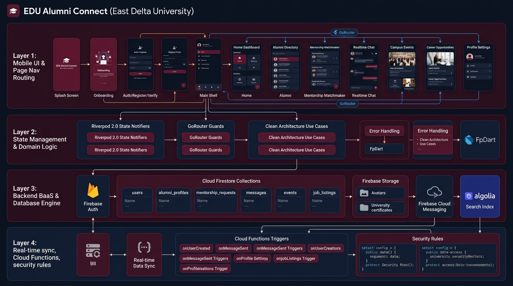

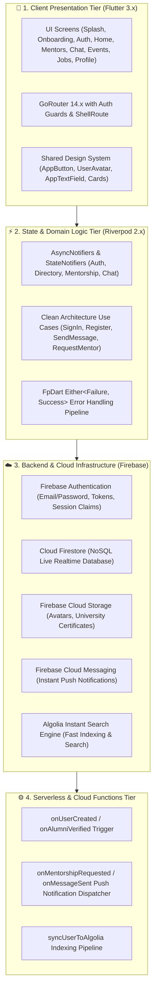

---

## 2. Master Application Page Routing & Navigation Flow

The mobile application utilizes declarative routing powered by **GoRouter** with an authenticated shell bottom navigation bar:

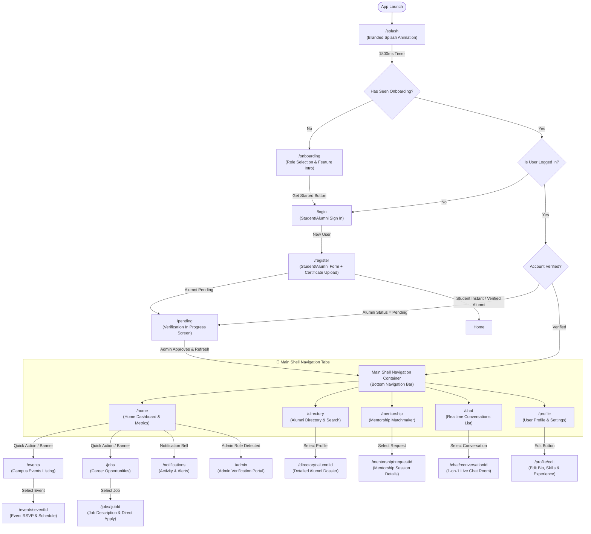

---

## 3. Core Feature Flowcharts & User Journeys

### A. Authentication, Registration & Verification Flow

```mermaid
flowchart TD
    A[User Opens App] --> B[Enter Credentials on /login]
    B --> C{Account Type}
    
    C -->|Existing User| D[Call FirebaseAuth.signInWithEmailAndPassword]
    D -->|Success| E[Fetch User Document from Firestore: users/{uid}]
    E --> F{Role & Verification Status}
    F -->|Alumni & Pending| G[Redirect to /pending Screen]
    F -->|Student / Verified Alumni| H[Redirect to /home Dashboard]
    D -->|Failure| I[Display Branded Error Dialog / Toast]
    
    C -->|New Account| J[Navigate to /register]
    J --> K{Selected Role}
    K -->|Student| L[Enter EDU Email: @eastdelta.edu.bd & Student ID]
    K -->|Alumni| M[Enter Alumni Details, Batch Year, Graduation Certificate PDF/Image]
    
    L --> N[Call FirebaseAuth.createUserWithEmailAndPassword]
    M --> O[Upload Certificate to Firebase Storage: certificates/{uid}]
    O --> N
    
    N --> P[Create Firestore Record: users/{uid} & alumni_directory/{uid}]
    P --> Q{Is Alumni?}
    Q -->|Yes| R[Set verification_status = 'pending'] --> G
    Q -->|No| S[Set verification_status = 'verified'] --> H
```

---

### B. Home Dashboard & Quick Actions Flow

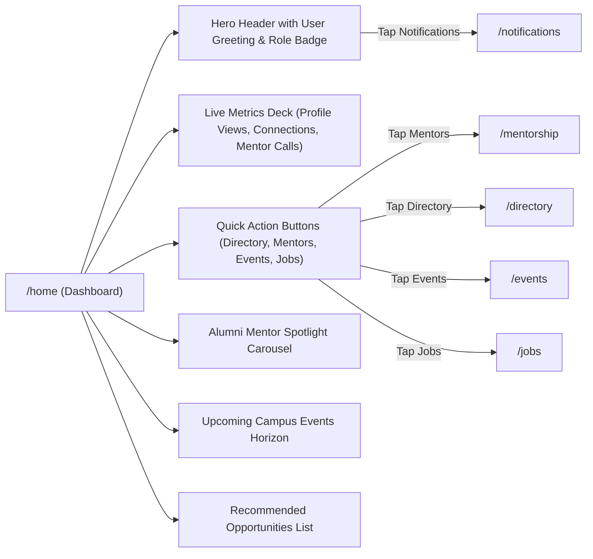

---

### C. Alumni Directory & Algolia Search Flow

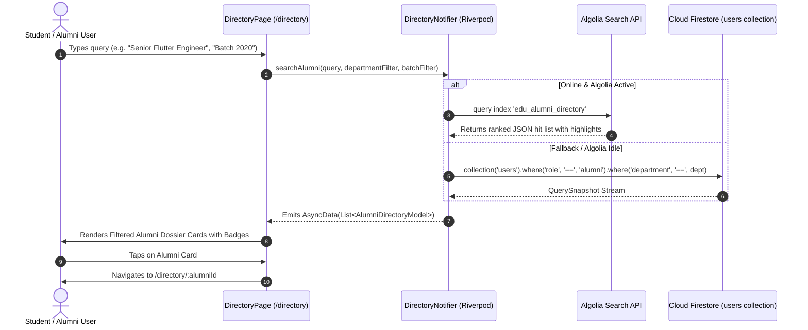

---

### D. Mentorship Matchmaking & 1-on-1 Request Lifecycle

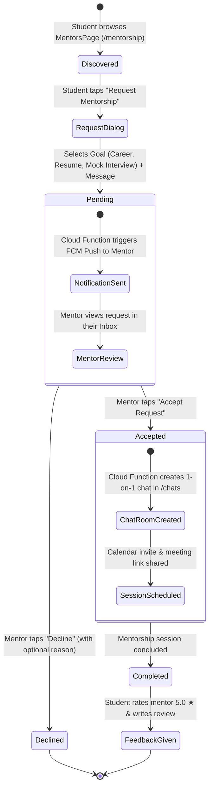

---

### E. Real-Time Chat & Messaging Pipeline

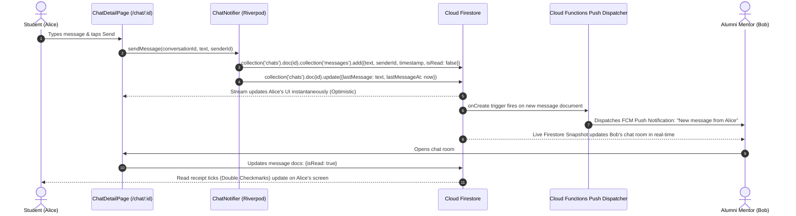

---

### F. Campus Events & Workshops Flow

```mermaid
flowchart TD
    A[EventsPage /events] --> B[Fetch Firestore: collection('events')]
    B --> C[Display Featured Event Banner & Date Filter Bar]
    C --> D[User Taps Event Card]
    D --> E[Navigate to /events/:eventId]
    
    E --> F{User RSVP Status}
    F -->|Not Registered| G[Show 'RSVP Now' Button]
    F -->|Already Registered| H[Show 'Registered' Badge + Add to Calendar Button]
    
    G -->|Tap RSVP| I[Update Firestore: events/{id}.attendees.add(uid)]
    I --> J[Add to User Record: users/{uid}.rsvp_events.add(eventId)]
    J --> K[Trigger Local Calendar Event via Device API]
    K --> H
```

---

### G. Career Opportunities & Job Board Flow

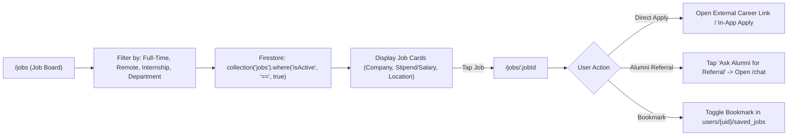

---

### H. Profile & Credential Management Flow

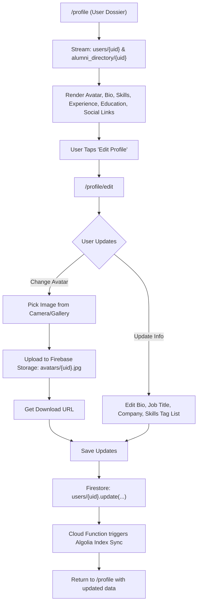

---

## 4. Page-to-Database Interaction Matrix

The table below provides a granular mapping between every application route, Flutter screen widget, state provider, and Cloud Firestore / Firebase Storage operations:

| Route Path | Screen / Widget | Riverpod Provider | Firebase / Storage Operation | CRUD Type | Trigger / Push |
| :--- | :--- | :--- | :--- | :--- | :--- |
| `/splash` | `SplashScreen` | `authStateProvider` | `FirebaseAuth.instance.authStateChanges()` | **Read** | Transitions to `/onboarding` or `/home` |
| `/onboarding` | `OnboardingScreen` | Local State / `SharedPreferences` | Sets local flag `onboarding_seen = true` | **Local Write** | Routes to `/login` |
| `/login` | `LoginScreen` | `signInNotifierProvider` | `FirebaseAuth.signInWithEmailAndPassword()` | **Auth Read** | Auth state stream updates router |
| `/register` | `RegisterScreen` | `registerNotifierProvider` | `FirebaseAuth.createUser()` + Storage `certificates/{uid}` + Firestore `users/{uid}` | **Create** | Sets verification status (`verified` or `pending`) |
| `/pending` | `VerificationPendingScreen` | `currentUserProvider` | `Firestore.collection('users').doc(uid).snapshots()` | **Live Stream** | Realtime transition to `/home` once admin approves |
| `/home` | `HomePage` | `currentUserProvider`, `directoryProvider` | `users/{uid}`, `events (limit 5)`, `jobs (limit 5)`, `alumni_directory` | **Live Stream** | Live metrics, spotlight carousel, quick tools |
| `/directory` | `DirectoryPage` | `directoryProvider` | Algolia Index `edu_alumni_directory` + Firestore `users` query | **Search / Read** | Dynamic filtering by batch year & department |
| `/directory/:id` | `AlumniProfilePage` | `alumniDetailProvider(id)` | `Firestore.collection('users').doc(id).snapshots()` | **Read** | Loads verified badges, work history, skills |
| `/mentorship` | `MentorsPage` | `mentorshipProvider` | `Firestore.collection('alumni_directory')` + `mentorship_requests` | **Read / Write** | "Request Mentorship" modal creates request record |
| `/mentorship/:id`| `MentorshipDetailPage` | `mentorshipDetailProvider(id)`| `Firestore.collection('mentorship_requests').doc(id)` | **Read / Update** | Accept / Reject mentorship session |
| `/chat` | `ChatPage` | `conversationsStreamProvider` | `Firestore.collection('chats').where('participants', 'array-contains', uid)` | **Live Stream** | Unread message counts, last message preview |
| `/chat/:id` | `ChatDetailPage` | `chatMessagesProvider(id)` | `Firestore.collection('chats').doc(id).collection('messages').orderBy('timestamp')` | **Stream / Create** | Sends message, updates read receipt, triggers FCM |
| `/events` | `EventsPage` | `eventsProvider` | `Firestore.collection('events').orderBy('date')` | **Live Stream** | Event category filter, RSVP status check |
| `/events/:id` | `EventDetailsPage` | `eventDetailProvider(id)` | `Firestore.collection('events').doc(id)` | **Read / Update** | RSVP toggles user UID in `attendees` array |
| `/jobs` | `OpportunitiesPage` | `jobsProvider` | `Firestore.collection('jobs').where('isActive', '==', true)` | **Live Stream** | Filters by full-time, part-time, internship |
| `/jobs/:id` | `JobDetailsPage` | `jobDetailProvider(id)` | `Firestore.collection('jobs').doc(id)` | **Read** | Job description, requirements, referral button |
| `/profile` | `ProfileScreen` | `currentUserProvider` | `Firestore.collection('users').doc(uid).snapshots()` | **Live Stream** | Displays profile completion meter & stats |
| `/profile/edit` | `EditProfileScreen` | `profileEditNotifierProvider` | Storage `avatars/{uid}` + Firestore `users/{uid}.update()` | **Update** | Syncs new bio, company, skills to Algolia |
| `/notifications`| `NotificationsPage` | `notificationsProvider` | `Firestore.collection('users').doc(uid).collection('notifications')` | **Live Stream** | Mark notifications read, direct route links |
| `/admin` | `AdminPortalPage` | `adminVerificationProvider` | `Firestore.collection('users').where('verification_status', '==', 'pending')` | **Read / Update** | Admin verifies/rejects alumni certificates |

---

## 5. End-to-End Sequence Diagrams

### Complete Mentorship Match to Real-Time Chat Lifecycle

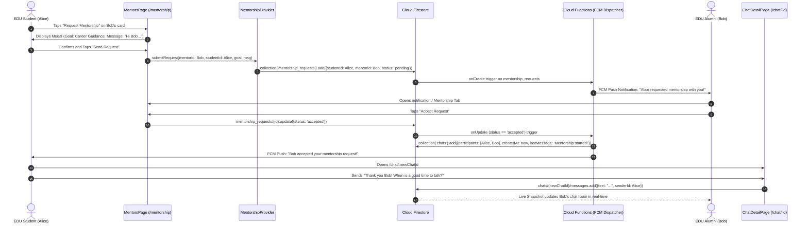

---

## 6. Security Rules & Access Control Matrix

```mermaid
graph TD
    subgraph Roles ["👥 Role-Based Access Control (RBAC)"]
        StudentRole["Student (@eastdelta.edu.bd)"]
        AlumniRole["Alumni (Verified Certificate)"]
        PendingAlumni["Alumni (Pending Verification)"]
        AdminRole["University Admin"]
    end

    subgraph Collections ["🔒 Cloud Firestore Security Enforcements"]
        UsersCol["users/{uid}<br/>• Public read for basic info<br/>• Self write only"]
        RequestsCol["mentorship_requests/{id}<br/>• Read/Write if participant in request<br/>• Admin read-all"]
        ChatsCol["chats/{id}/messages/{msgId}<br/>• Read/Write only if UID in participants array"]
        EventsCol["events/{id}<br/>• Public read<br/>• Admin write only<br/>• Users can update attendees array"]
        JobsCol["jobs/{id}<br/>• Public read<br/>• Verified Alumni & Admin write"]
        AdminCol["admin_logs & verifications<br/>• Admin role only (Custom Claims)"]
    end

    StudentRole -->|Read/Write Self| UsersCol
    StudentRole -->|Create & View Own| RequestsCol
    StudentRole -->|Read & Send if Participant| ChatsCol
    StudentRole -->|Read & RSVP| EventsCol
    StudentRole -->|Read & Apply| JobsCol

    AlumniRole -->|Read/Write Self| UsersCol
    AlumniRole -->|Accept/Decline Own| RequestsCol
    AlumniRole -->|Read & Send if Participant| ChatsCol
    AlumniRole -->|Read & RSVP| EventsCol
    AlumniRole -->|Post Opportunities| JobsCol

    PendingAlumni -->|Read Self Only| UsersCol
    PendingAlumni -->|Blocked from Directory/Chat| ChatsCol

    AdminRole -->|Full Read/Write Access| UsersCol
    AdminRole -->|Verify/Reject| AdminCol
    AdminRole -->|Manage Events| EventsCol
    AdminRole -->|Manage Jobs| JobsCol
```

---

## 7. Summary & Best Practices

1. **Clean Architecture Separation**: Presentation (Widgets) is strictly decoupled from Data Sources via Riverpod Notifiers and Use Cases.
2. **Offline-First & Resilience**: App gracefully falls back to local cached snapshots when network connectivity is interrupted.
3. **Reactive UI Updates**: All active lists (Chat messages, Notifications, Requests) consume reactive Firestore Streams for instantaneous state syncing.
4. **Declarative Navigation**: GoRouter provides URL-based deep linking and route protection via unified auth guards.
